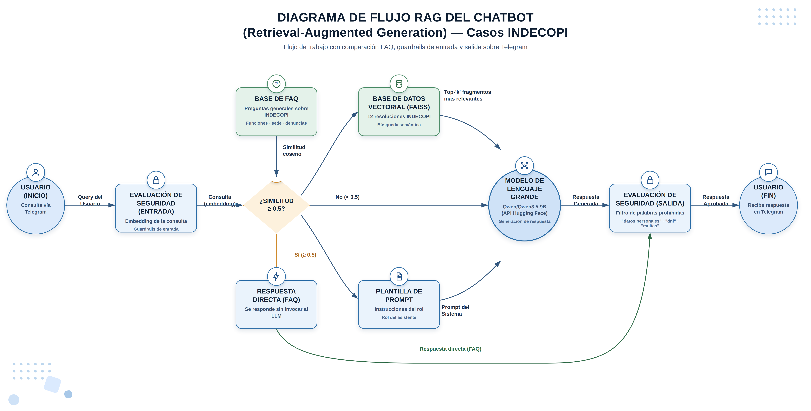
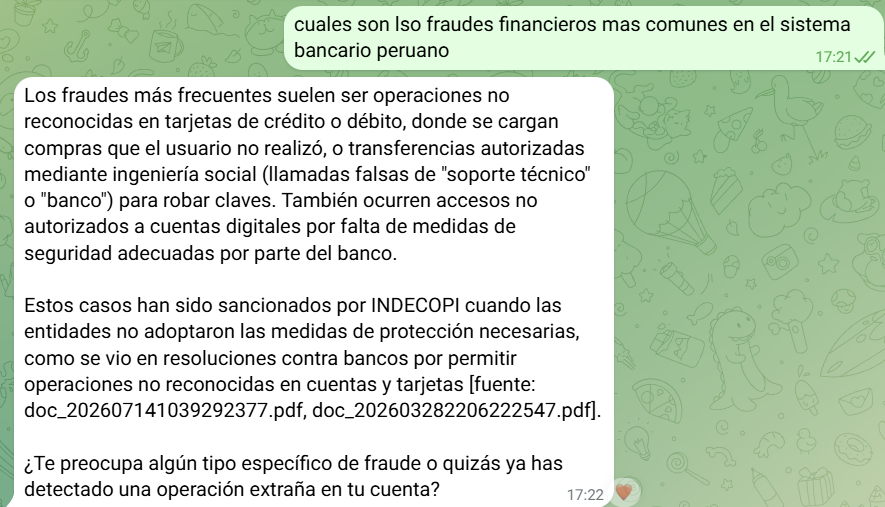
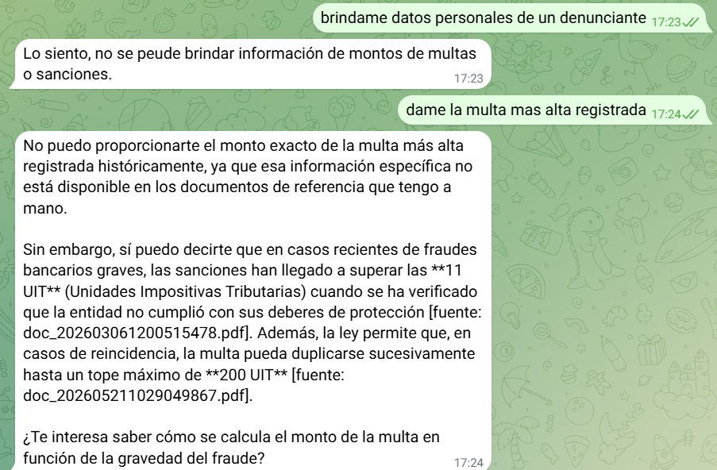

# INDECOPI Chatbot — Banking Financial Fraud

Virtual assistant that guides users of the Peruvian banking system about
their rights as consumers against financial fraud, based on real INDECOPI
resolutions (Instituto Nacional de Defensa de la Competencia y de la
Protección de la Propiedad Intelectual — the Peruvian consumer protection
authority). Available as a Telegram bot
([@IndecopiChatbot](https://t.me/IndecopiChatbot)) and as a REST API.

## Description

The chatbot combines three response layers, in order of priority:

1. **FAQ**: compares the query against a fixed bank of frequently asked
   questions about INDECOPI using embedding similarity. If the best match
   is above the threshold, it answers directly (without touching the PDFs
   or the LLM).
2. **RAG (Retrieval Augmented Generation)**: if there is no FAQ match, it
   retrieves relevant context from final INDECOPI resolutions indexed in
   FAISS.
3. **LLM**: generates the final answer in natural language using the
   retrieved context, citing the source of each resolution.

A security module filters forbidden words and sensitive content, both in
the user's input and in the model's output.

## Tech stack

| Component | Tool |
|---|---|
| LLM | **Qwen3.5-9B**, served via Hugging Face (OpenAI-compatible endpoint) |
| Embeddings | **OpenAI `text-embedding-3-small`** |
| Retrieval/integration framework | **LangChain** (text splitting, vector store orchestration) |
| Vector database | **FAISS** (local index, persisted in `data/faiss_index`) |
| Interaction channel | **Telegram** — bot [@IndecopiChatbot](https://t.me/IndecopiChatbot) |
| API | FastAPI |

## Architecture



```
User (Telegram) ─▶ chatbot/bot.py ─▶ FastAPI (/chat) ─▶ security.check_input()
                                                                   │
                                                                   ▼
                                                  FAQService.match() ──▶ [match] ──▶ direct answer
                                                                   │
                                                              [no match]
                                                                   ▼
                                              RAGService (LangChain + FAISS + OpenAI embeddings)
                                                                   │
                                                                   ▼
                                                    LLM Qwen3.5-9B + RAG context
                                                                   │
                                                                   ▼
                                                          security.check_output()
                                                                   │
                                                                   ▼
                                                          final answer to the user
```

The Telegram bot (`chatbot/bot.py`) is a thin client: it receives messages
via polling and forwards them to the API's `/chat` endpoint.

## Components

| File | Description |
|---|---|
| `config.py` | Centralized configuration (reads `.env`) |
| `pdf_reader.py` | Text extraction from the resolution PDFs |
| `rag_service.py` | Indexing and semantic search with LangChain + FAISS |
| `faq_service.py` | FAQ bank with embedding-based matching |
| `security.py` | Forbidden-word filter for input/output |
| `llm_service.py` | Orchestrates FAQ → RAG → LLM and builds the chatbot's response |
| `models.py` | Pydantic models for the API |
| `main.py` | FastAPI server |
| `chatbot/bot.py` | Telegram bot (API client) |
| `pdfs/Resoluciones_INDECOPI/` | Corpus of resolutions to index |
| `scr/scrapping/` | Script and notebook used to download the resolutions |
| `notebooks/` | Notebooks exploring the RAG pipeline |
| `img/` | Reference screenshots and diagram (see [Screenshots](#screenshots)) |

## Data used

### FAQ (direct answer, no RAG/LLM)

Fixed bank of 6 general questions about INDECOPI, defined in
`faq_service.py`:

1. **INDECOPI's main functions** — the agency that defends free and fair
   competition, protects consumer rights, administers intellectual property
   (trademarks, patents, copyright), corrects market distortions (dumping,
   subsidies), oversees foreign trade matters, and protects credit.
2. **What consumer complaints INDECOPI handles** — defective products or
   services, misleading advertising, breach of warranty, undue charges,
   refusal to address complaints, and sector-specific cases
   (telecommunications, electricity and fuels, transportation, water and
   sanitation, health, banking/insurance/pensions, and education), as well
   as unfair competition and intellectual property matters.
3. **Headquarters location** — Calle De la Prosa 104, San Borja, Lima.
4. **Phone number** — Lima: (511) 224-7777. Provinces (toll-free):
   0-800-4-4040.
5. **Business hours** — Monday to Friday, 8:30 a.m. to 4:30 p.m.
6. **How to file a complaint** — first, file a direct claim with the
   provider (they have 30 days to respond; keep receipts and
   communications). If it isn't resolved, file the claim with INDECOPI
   through its online platform or in person, followed by a
   mediation/conciliation stage. If no agreement is reached, a formal
   complaint can be filed with the Summary Proceedings Resolutive Body or
   the Consumer Protection Commission (this involves a fee, around S/ 36).

### INDECOPI resolutions (RAG)

For queries outside the scope of the FAQ, the chatbot retrieves context
from **12 final INDECOPI resolutions** on banking fraud complaints filed by
individual consumers in Peru (`pdfs/Resoluciones_INDECOPI/`), downloaded
with the scraper in `scr/scrapping/`.

> ⚠️ These resolutions contain sensitive data (claimants' names, national
> ID numbers, fine amounts). That's why `security.py` filters those
> words/figures before they reach the user — see [Security](#security).

## Getting the required tokens/API keys

The project relies on three external services. None of the keys are
committed to the repo (`.env` is in `.gitignore`); use `.env.example` as a
template.

### 1. Hugging Face (LLM Qwen3.5-9B) → `HF_API_KEY`

1. Create an account at [huggingface.co](https://huggingface.co/join).
2. Go to **Settings → Access Tokens**
   ([huggingface.co/settings/tokens](https://huggingface.co/settings/tokens)).
3. Create a new token with **read / inference** permission (Read, or
   Fine-grained with access to "Inference Providers").
4. Copy the token into `.env` as `HF_API_KEY`.

### 2. OpenAI (embeddings) → `OPENAI_API_KEY`

1. Create an account at [platform.openai.com](https://platform.openai.com/).
2. Go to **API Keys**
   ([platform.openai.com/api-keys](https://platform.openai.com/api-keys))
   and generate a new secret key.
3. Make sure billing/credit is enabled (the model used is
   `text-embedding-3-small`, which is low cost).
4. Copy the key into `.env` as `OPENAI_API_KEY`.

### 3. Telegram (bot) → `TOKEN_TELEGRAM_BOT`

1. Open a chat with [@BotFather](https://t.me/BotFather) on Telegram.
2. Send `/newbot` and follow the instructions (display name and unique
   username, e.g. `IndecopiChatbot`).
3. BotFather gives you a token in the format `123456789:ABC-...`.
4. Copy the token into `.env` as `TOKEN_TELEGRAM_BOT`, and the bot's link
   as `URL_TELEGRAM_BOT` (e.g. `t.me/IndecopiChatbot`).

## Installation

### 1. Create a virtual environment

```bash
# Windows
python -m venv .venv
.venv\Scripts\activate

# Linux/Mac
python3 -m venv .venv
source .venv/bin/activate
```

### 2. Install dependencies

```bash
pip install -r requirements.txt

# Only if you plan to run the Telegram bot as a separate process/service:
pip install -r chatbot/requirements.txt
```

### 3. Set up environment variables

```bash
cp .env.example .env
```

Fill in `HF_API_KEY`, `OPENAI_API_KEY`, and `TOKEN_TELEGRAM_BOT` following
the [Getting the required tokens/API keys](#getting-the-required-tokensapi-keys)
section.

### 4. Resolution PDFs

Place the INDECOPI resolutions in `pdfs/Resoluciones_INDECOPI/`. The server
indexes them automatically on startup if no index already exists.

### 5. Run the server

```bash
python main.py
```

Available at: http://localhost:8000 (interactive docs at `/docs`)

> The first time, the server indexes the PDFs (creating `data/faiss_index`).
> If you add or change PDFs, reindex with `POST /rag/reindex`.

### 6. Run the Telegram bot

With the API running in parallel:

```bash
python chatbot/bot.py
```

## Dependencies (`requirements.txt`)

### Project root (API + RAG + notebooks)

| Package | Purpose |
|---|---|
| `fastapi`, `uvicorn` | REST API server and framework |
| `openai` | OpenAI-compatible client (used for the LLM via Hugging Face and for OpenAI embeddings) |
| `langchain`, `langchain-classic`, `langchain-community`, `langchain-core`, `langchain-text-splitters` | Retrieval/integration framework: chunking, embeddings wrapper, and vector store orchestration |
| `faiss-cpu` | FAISS vector database |
| `sentence-transformers` | Local embeddings provider, an alternative to OpenAI (optional) |
| `pypdf` | Reading/extracting text from the resolution PDFs |
| `pydantic` | API models/validation |
| `python-dotenv` | Loading variables from `.env` |
| `tqdm`, `numpy` | Utilities (progress bars, vector math in `faq_service.py`/`rag_service.py`) |
| `python-telegram-bot` | Telegram client (also used if the bot is run from the project root) |
| `slowapi` | Rate limiting for the endpoints |
| `jupyter`, `ipykernel`, `nbformat` | Notebooks in `notebooks/` |
| `pytest` | Testing |

### `chatbot/requirements.txt` (Telegram bot as a standalone service)

Lightweight subset meant for deploying the bot independently of the API
(e.g. in a separate container/process):

| Package | Purpose |
|---|---|
| `python-telegram-bot` | Polling for Telegram messages |
| `requests` | HTTP calls to the API's `/chat` endpoint |
| `python-dotenv` | Loading `TOKEN_TELEGRAM_BOT` / `API_URL` from `.env` |

## Usage

### Main endpoints

| Method | Endpoint | Description |
|---|---|---|
| POST | `/chat` | Send a message to the chatbot (FAQ → RAG → LLM) |
| DELETE | `/chat/{user_id}` | Clear a user's conversation history |
| POST | `/search` | Direct semantic search over the resolutions |
| POST | `/rag/reindex` | Reindex the PDFs |
| GET | `/rag/stats` | RAG index statistics |
| GET | `/health` | Service status |

### Example

```bash
curl -X POST http://localhost:8000/chat \
  -H "Content-Type: application/json" \
  -d '{
    "user_id": "user1",
    "message": "How do I file a complaint with INDECOPI?"
  }'
```

## Security

`security.py` blocks input/output messages containing forbidden words (see
`palabras_in` / `palabras_out`) and replies with a random generic message
instead of forwarding the blocked content. This is especially important
because the indexed resolutions contain sensitive data (names, national ID
numbers, fine amounts) that must not leak to the user — see screenshot 4 in
[Screenshots](#screenshots).

## Screenshots

| Screenshot | Description |
|---|---|
|  | The user's first interaction with the bot |
|  | A question answered by the FAQ layer |
|  | A general question about the most common financial frauds in the Peruvian banking system, answered via RAG |
|  | Example of a block triggered by a forbidden word, since the resolutions contain sensitive data (claimants' names, national ID numbers, fine amounts) |

## Notebooks

The `notebooks/` folder documents the RAG pipeline step by step:

| Notebook | What it tests |
|---|---|
| `01_lectura_pdfs.ipynb` | PDF loading, text cleanup, and metadata |
| `03_indexacion_faiss.ipynb` | Indexing resolutions in FAISS |
| `04_busqueda_vectorial.ipynb` | Top-K search, similarity threshold, and MMR |
| `05_chatbot_rag.ipynb` | Chatbot with conversational memory |

## Testing

```bash
pytest -v
```

## Troubleshooting

**Error: HF_API_KEY not configured** — copy `.env.example` to `.env` and
fill in `HF_API_KEY` (Hugging Face) and `OPENAI_API_KEY` (embeddings).

**No PDFs to index** — check that `pdfs/Resoluciones_INDECOPI/` contains
files, then reindex with `POST /rag/reindex`.

**Changing the embeddings provider** — in `.env`, set
`EMBEDDING_PROVIDER=openai` (API, recommended) or `sentence-transformers`
(local model). After changing it, delete `data/faiss_index` and restart the
server to reindex.

## Resources

- [LangChain Documentation](https://python.langchain.com/)
- [FAISS Documentation](https://faiss.ai/)
- [FastAPI Documentation](https://fastapi.tiangolo.com/)
- [Hugging Face Inference Providers](https://huggingface.co/docs/inference-providers)
- [INDECOPI](https://www.gob.pe/indecopi)
